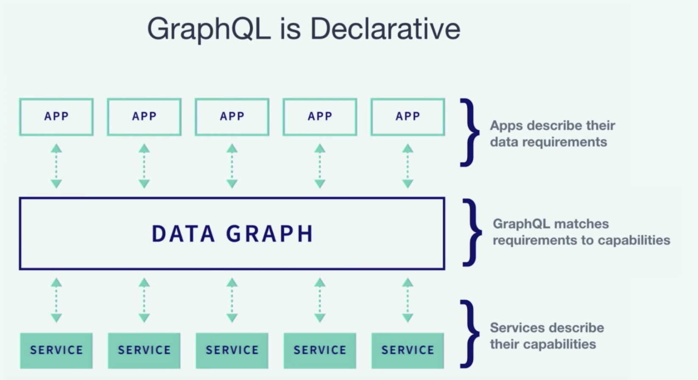
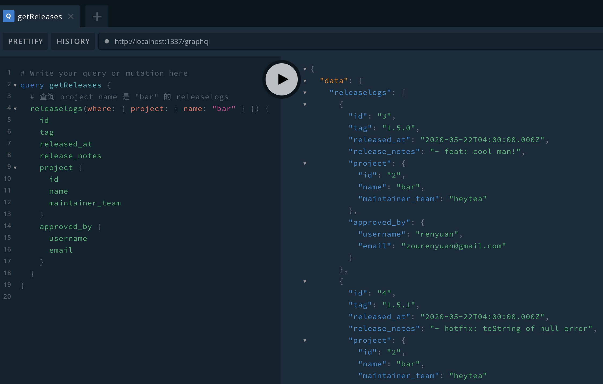

## GraphQL API

介绍完大家熟悉的 REST API 部分，重头戏来了。自动生成的还有 GraphQL API，GraphQL 是 Facebook 在 2015 年开源的数据查询和操作语言，相较于 REST 等其他 web service 架构提供了一种高效且灵活的 Web API 开发方案。

GraphQL 是声明式的（declarative），它与命令式编程不同的地方在于，你不用关心怎么拿到数据（How），而只用关心你要拿到什么数据（What）。



举个例子吧，如果要完成我草图中画的界面，能根据 project 来筛选 releaselogs，并且返回的 releaselog 里面要包含 `project` 和负责人 `user` 的数据。用 REST 的方式，我们会怎么做？

我们会有一个接口请求一个`GET /releaselogs?project_id=1` 列表，在数据返回后，再请求 N 次`GET /users/:id`接口（或者用所有的 user id 组成一个列表去请求 `GET /users?ids=1,2,3` 接口）。

但是通常我们会单独做一个接口，返回的 releaselogs 中加上 `project` 和 `user` 信息。

**你看，REST 风格里，“接口”往往必须和“场景”耦合。**

确认你在插件市场里已经安装好了 GraphQL 的插件。

用 GraphQL 可以怎么做呢？打开 http://localhost:1337/graphql ，这是一个 online editor，连 postman 都省了。在左边区域写一段 GraphQL 语句，运行，右边区域就可以看到返回的结果。

```graphql
query getReleases {
  # 查询 project name 是 "bar" 的 releaselogs
  releaselogs(where: { project: { name: "bar" } }) {
    id
    tag
    released_at
    release_notes
    project {
      id
      name
      maintainer_team
    }
    approved_by {
      username
      email
    }
  }
}
```



我相信大家可以很快的 get 到这样做的优点，虽然 REST 风格的接口也能做到这样的能力，但是我想要强调的并不是这种灵活的请求接口的能力，**而是它描述数据的能力对开发者的心智模型来说是非常自然的。**

而 strong type 强静态类型的特性使得它的工具链非常强大，除了语法检查、自动补全、编译时报错，配合 GraphQL codegen 更是能自动生成 React HOC / React Hooks / Vue composition functions，让你少写很多代码。

The Best Code is No Code At All.

## 小结

至此大家已经了解了如何使用 Strapi 快速构建一套 API 接口（无论是 REST 风格还是 GraphQL API）。

在我去年第一次接触到 Strapi 的时候真的是情不自禁地感叹到：WOW~ 希望这篇分享也会给你带来这种兴奋感。

虽然 Strapi 还很年轻，但是已经有很多工业巨头在使用，包括 IBM 和法国兴业银行等。说明它的安全性、性能、开发效率都是得到了广泛认可的。

示例项目的源码会和本文的下篇一起放出，欢迎关注哦~
