软件开发的工作中不可避免的会遇到突发的生产环境事故，尤其是微服务架构下的今天，当一场事故发生后，如何快速定位到问题根源就极为重要。

于是一个想法顺势而生：在 Jenkins（或其他 CI/CD 系统）中自动记录所有项目的发布变更和变更详细内容，并能按时间、按项目、按团队进行筛选。

做个网站对于程序员来说并没有什么难度，但是平时工作那么多，如何**快速**实现这个想法就变得尤其重要。

**于是就有了今天要分享的内容**

> 使用 Strapi 构建 GraphQL API，配合上 React.js，Typescript 和 GraphQL codegen 来快速构建一个发布变更系统。

全文分为“上”、“下” 两个部分，分别介绍 API 部分和前端部分。

## Strapi

这里着重介绍一下 Strapi，（官网地址：https://strapi.io ）是一个开源的 Node.js Headless CMS，可以通过 UI 界面去定义模型关系来自动生成数据库、RESTful API、GraphQL API 和 swagger API 文档。

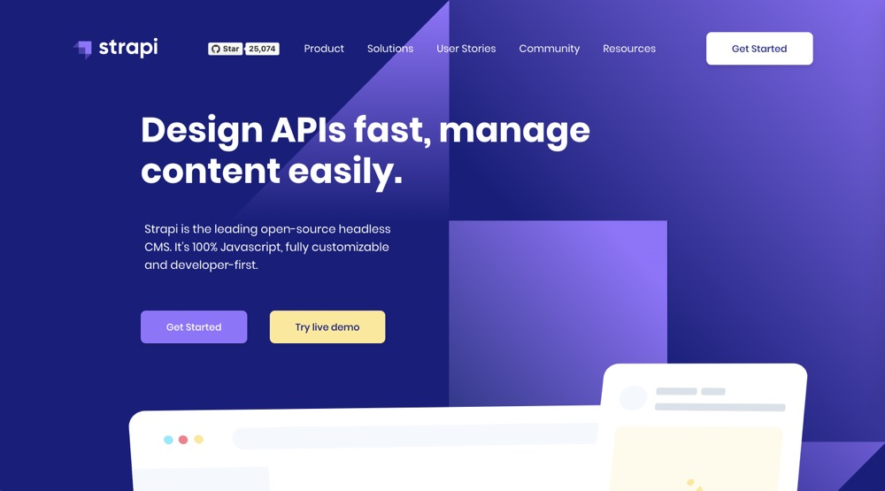

近几年 headless CMS 的概念很火，其实 headless 字面意思是“无头的”，这里理解为不提供前端界面的 CMS 系统，只提供 API 接口。多样化的客户端撼动了传统 CMS（如 WordPress）的地位，APP、小程序、H5 的爆发，加速了前后端技术的相互独立。

提到 Headless CMS，还有一个不错的选项是 contentful，可以理解为上了云的 Strapi。而另一个有着相似概念的（通过 schema 生成 API）由 IBM 开源的 node.js API 框架 loopback，都是不错的可选性。

为什么偏偏选了 Strapi？以下是 Strapi 与 contentful，loopback 的对比。

|                      | Strapi | contenful | loopback |
| -------------------- | ------ | --------- | -------- |
| self-hosted          | ✅     | ❌        | ✅       |
| 可视化管理界面       | ✅     | ✅        | ❌       |
| 定制能力强的插件系统 | ✅     | ❌        | ✅       |

在前后端分离的大环境下，Strapi 可以让（前端）工程师快速完成一套「功能完整」且「性能强大」的 API，并可以部署在自己的服务器上，使得这个方案脱颖而出。也是半个小时完成 API 接口的必要条件。

## 安装 Strapi cli

```bash
yarn create strapi-app my-project --quickstart
```

## 画模型关系图

在等待安装的过程中，我们可以先构思一下将要构建的系统模型关系。

以我做的版本发布记录系统为例，这个系统主要用来记录版本发布，版本发布中我需要知道它属于那个项目以及发布的版本号、发布时间、发布内容（release note）等信息。

简单画个图，将就看一下。

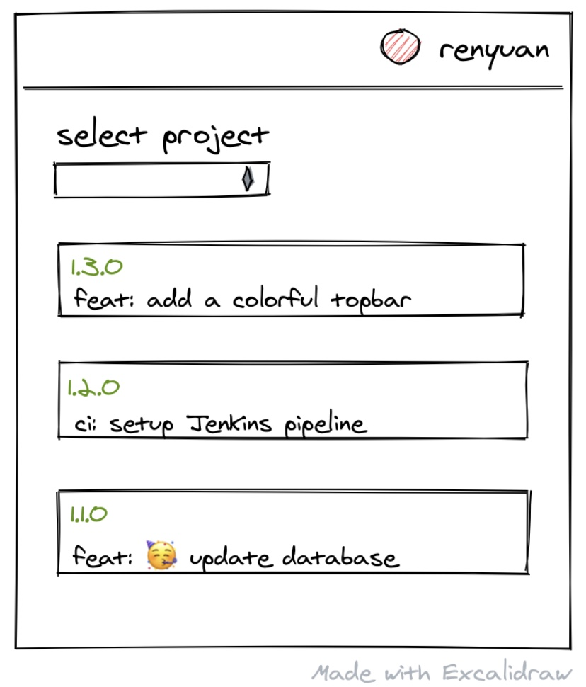

于是模型关系便不难做出来：

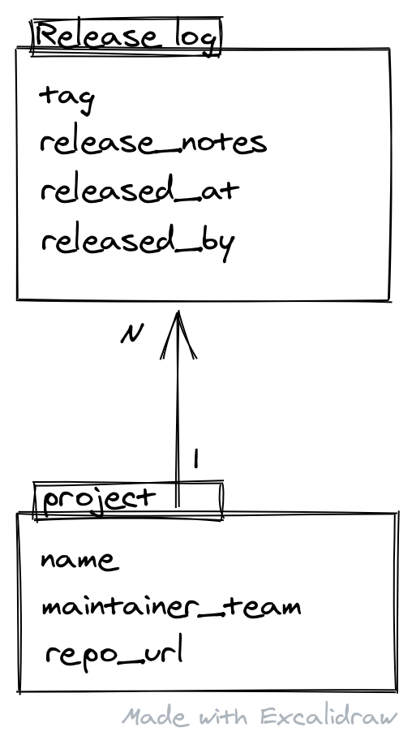

虽然最终的系统比这个模型图要复杂很多，但是用于教程已经足够了。

（画图工具是一个开源的免费的网站：https://excalidraw.com/ 用的是端到端加密，非常安全，同时也支持多人协同编辑哦~）

## 创建 Content type

有了这个模型关系，你就可以开始用 Strapi 搭建 schema 了。Strapi 目前支持 mongodb，sqlite，mysql 和 postgresql。本地开发默认使用 sqlite，所以也不用安装其他的数据库依赖。

安装好 Strapi 项目后，进入项目根目录，执行 yarn start，服务器默认端口是 1337，打开浏览器访问 http://localhost:1337/admin 并创建一个管理员用户。进入后台后直接开始创建 content type。

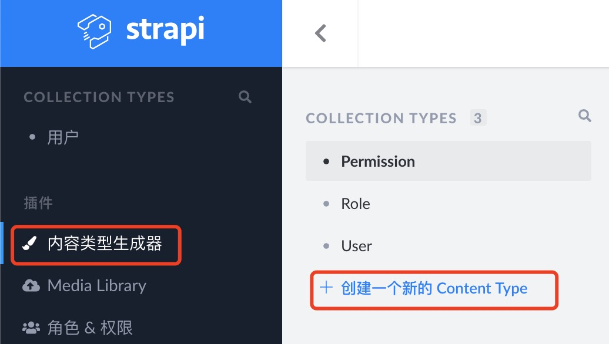

现在开始定义 releaselog 的字段。

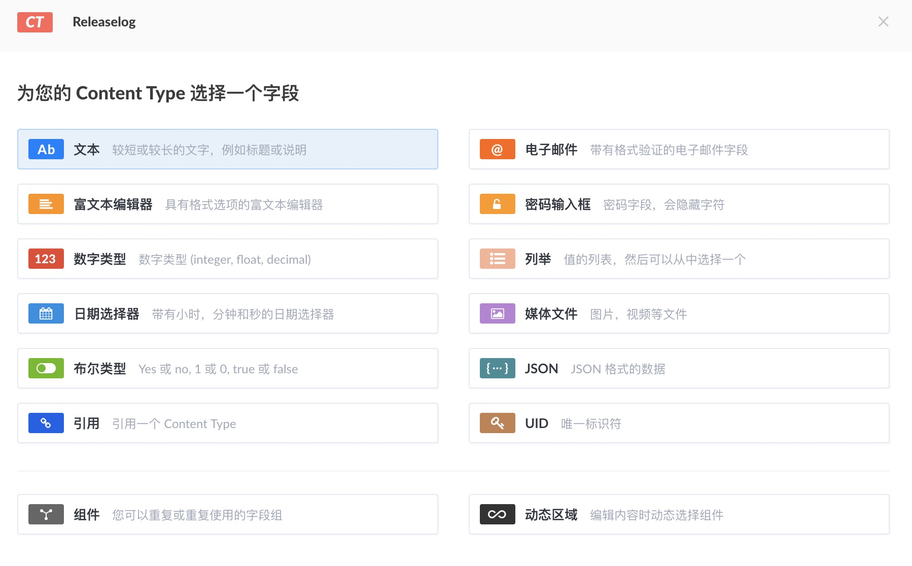

这里要着重介绍一下「引用」类型的字段，也就是 releaselog 里面的 `approved_by` (表示发布 releaselog 的负责人)，用来对应 Strapi 原生集成的 User 类型。

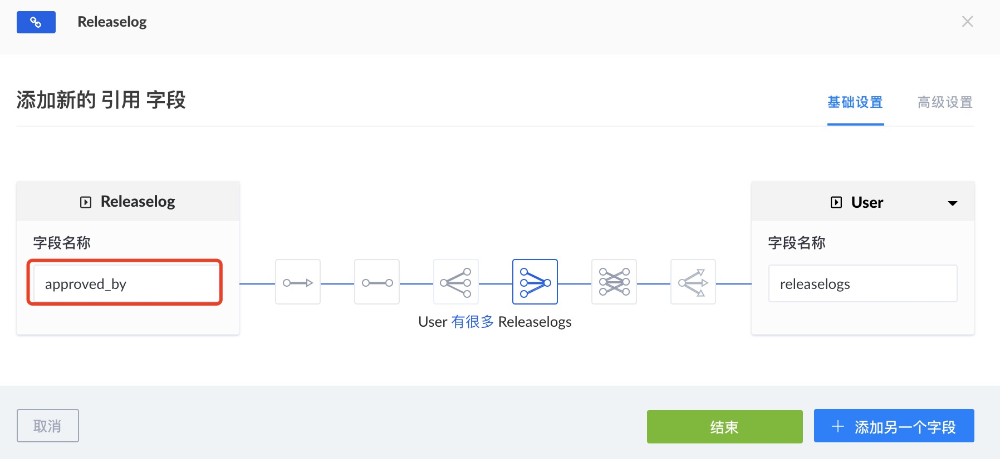

然后在完成所有的字段定义后，就可以点击右上角的保存了。

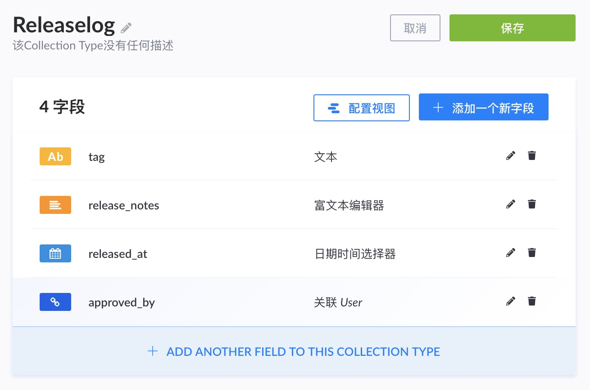

每次保存 content type 的时候，Strapi 会自动重启，并在项目中生成对于的 model，controller 文件，创建或更新数据库表结构。

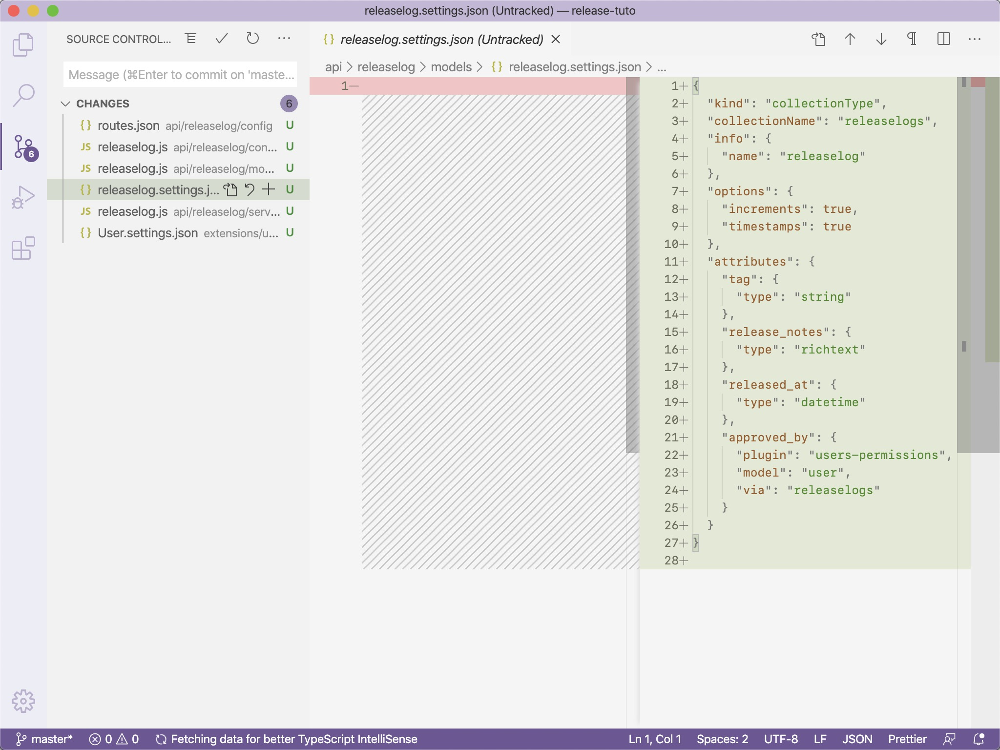

接着完成 project 的字段定义，这里要加上对 releaselog 的「引用」类型。

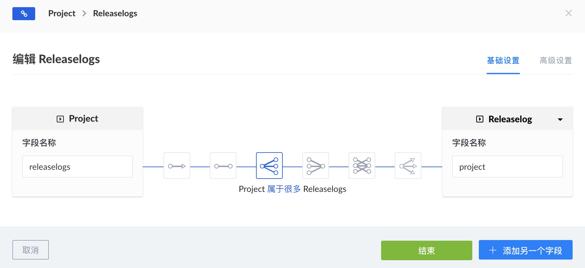

这是定义好的 project 类型。点击保存。

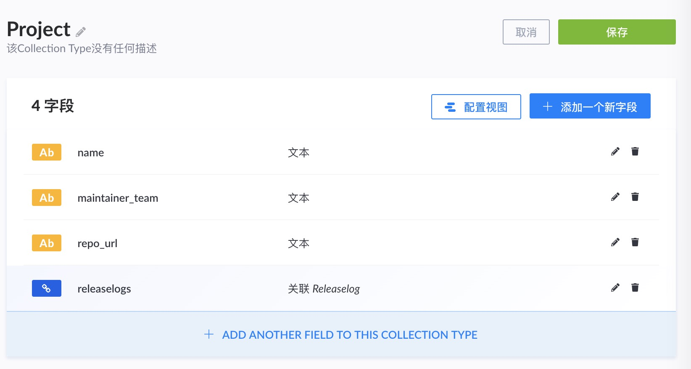

然后我们接着创建几个用来测试的数据。

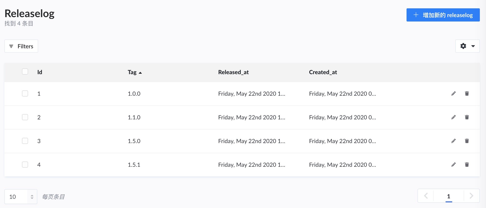

现在试试访问 http://localhost:1337/projects

hmm...报错了，403 Forbidden，无权访问接口。

其实这是 Strapi 内建的 permission 系统，所有的接口是默认默认不开放给 public 的，要修改这个配置也很简单。去到 User - permission 页面，user 被默认分为两个角色，public 和 authenticated，这里我们暂时不接入用户系统，所以把 public 里面的接口权限开放即可。

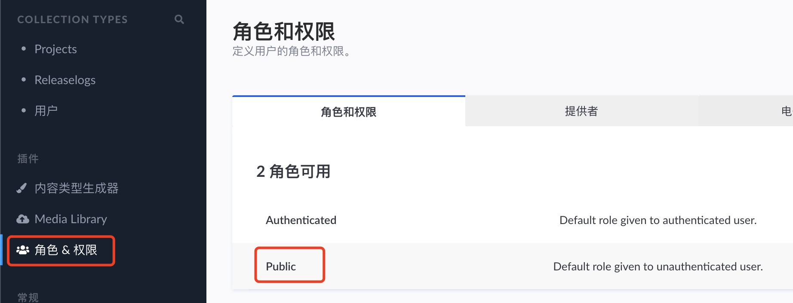

勾选上 releaselog 和 project 下面的`count`, `find`, `findone`的权限。

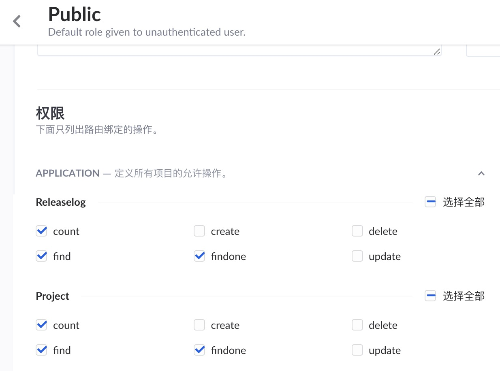

刷新 /projects，数据就可以正确显示出来了。

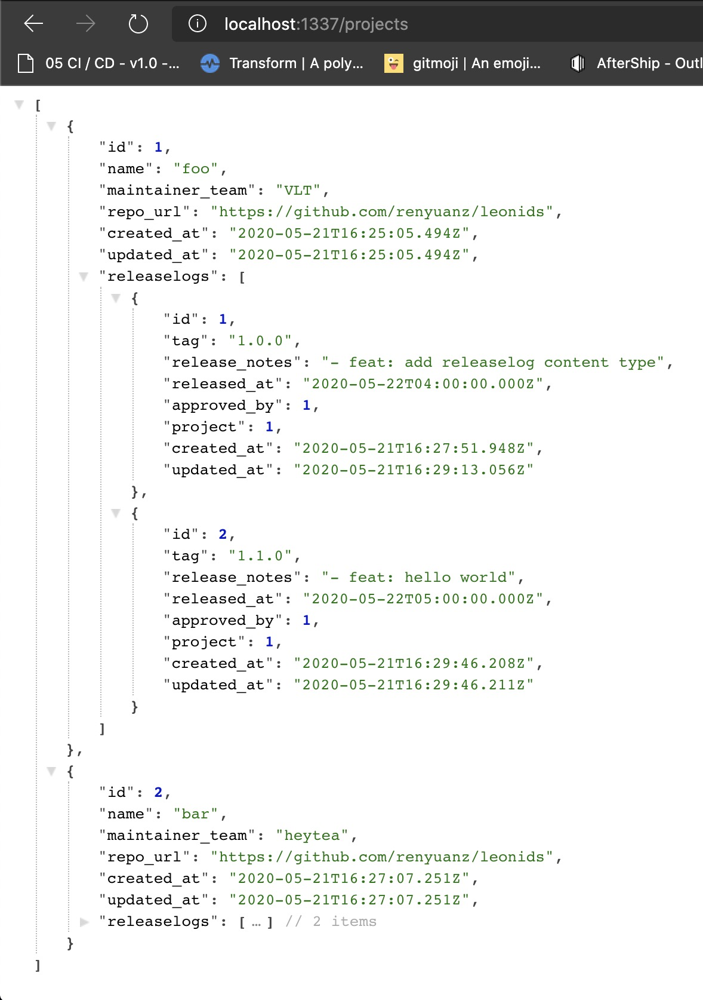

这里也默认包含了 project 的「引用类型」releaselog 在 json 中，相同地，查询 releaselog 时，project 也会被查询出来，而且自带的 ORM 对查询做了优化，不会导致 N+1 的性能问题。

## Swagger Doc

除了 API 接口是自动生成的，就连 swagger 文档都生成好了。在后台找到 marketplace（市场） 页面，安装 documentation 插件（顺便也可以把 GraphQL 的插件也安装了，后面会讲到）。

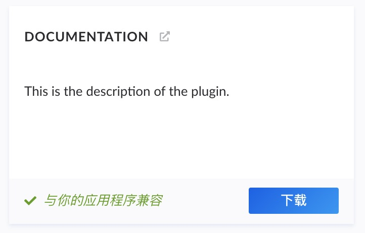

等待安装重启后，导航栏多了一个 doc 页面，点击 open doc 或者访问 http://localhost:1337/documentation/v1.0.0 就可以看到文档了。

这所有的一切，在半小时内就能完成，它不香吗！

## GraphQL API

介绍完大家熟悉的 REST API 部分，重头戏来了。自动生成的还有 GraphQL API，GraphQL 是 Facebook 在 2015 年开源的数据查询和操作语言，相较于 REST 等其他 web service 架构提供了一种高效且灵活的 Web API 开发方案。

GraphQL 是声明式的（declarative），它与命令式编程不同的地方在于，你不用关心怎么拿到数据（How），而只用关心你要拿到什么数据（What）。

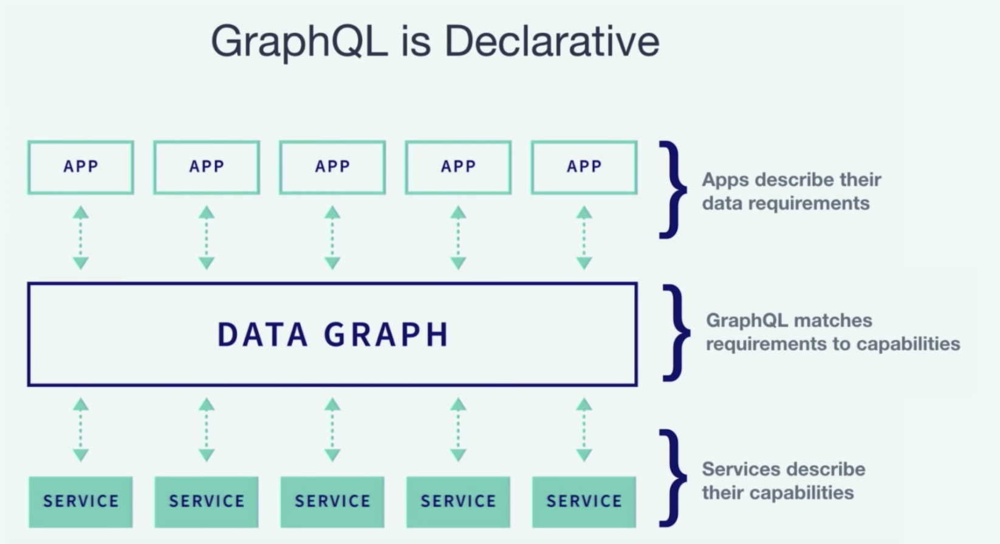

举个例子吧，如果要完成我草图中画的界面，能根据 project 来筛选 releaselogs，并且返回的 releaselog 里面要包含 `project` 和负责人 `user` 的数据。用 REST 的方式，我们会怎么做？

我们会有一个接口请求一个`GET /releaselogs?project_id=1` 列表，在数据返回后，再请求 N 次`GET /users/:id`接口（或者用所有的 user id 组成一个列表去请求 `GET /users?ids=1,2,3` 接口）。

但是通常我们会单独做一个接口，返回的 releaselogs 中加上 `project` 和 `user` 信息。

**你看，REST 风格里，“接口”往往必须和“场景”耦合。**

用 GraphQL 可以怎么做呢？打开 http://localhost:1337/graphql ，这是一个 online editor，连 postman 都省了。在左边区域写一段 GraphQL 语句，运行，右边区域就可以看到返回的结果。

```graphql
query getReleases {
  # 查询 project name 是 "bar" 的 releaselogs
  releaselogs(where: { project: { name: "bar" } }) {
    id
    tag
    released_at
    release_notes
    project {
      id
      name
      maintainer_team
    }
    approved_by {
      username
      email
    }
  }
}
```

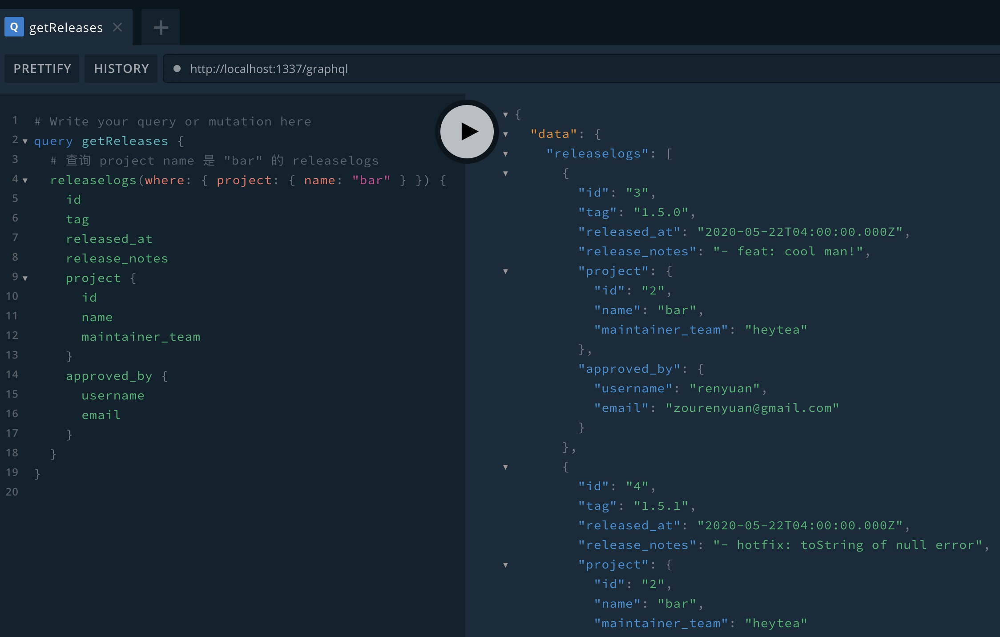

我相信大家可以很快的 get 到这样做的优点，虽然 REST 风格的接口也能做到这样的能力，但是我想要强调的并不是这种灵活的请求接口的能力，**而是它描述数据的能力对开发者的心智模型来说是非常自然的。**

而 strong type 强静态类型的特性使得它的工具链非常强大，除了语法检查、自动补全、编译时报错，配合 GraphQL codegen 更是能自动生成 React HOC / React Hooks / Vue composition functions，让你少写很多代码。

The Best Code is No Code At All.

## 小结

至此大家已经了解了如何使用 Strapi 快速构建一套 API 接口（无论是 REST 风格还是 GraphQL API）。

在我去年第一次接触到 Strapi 的时候真的是情不自禁地感叹到：WOW~ 希望这篇分享也会给你带来这种兴奋感。

虽然 Strapi 还很年轻，但是已经有很多工业巨头在使用，包括 IBM 和法国兴业银行等。说明它的安全性、性能、开发效率都是得到了广泛认可的。

示例项目的源码会和本文的下篇一起放出，欢迎关注哦~
