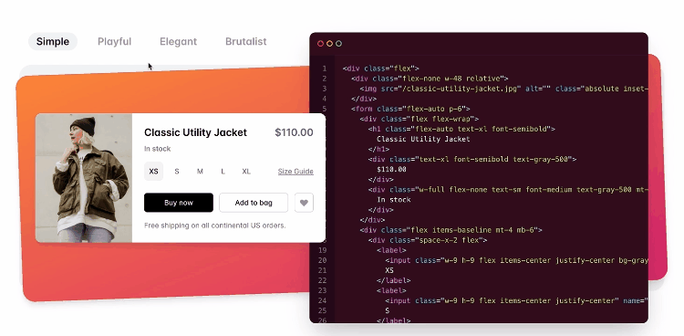
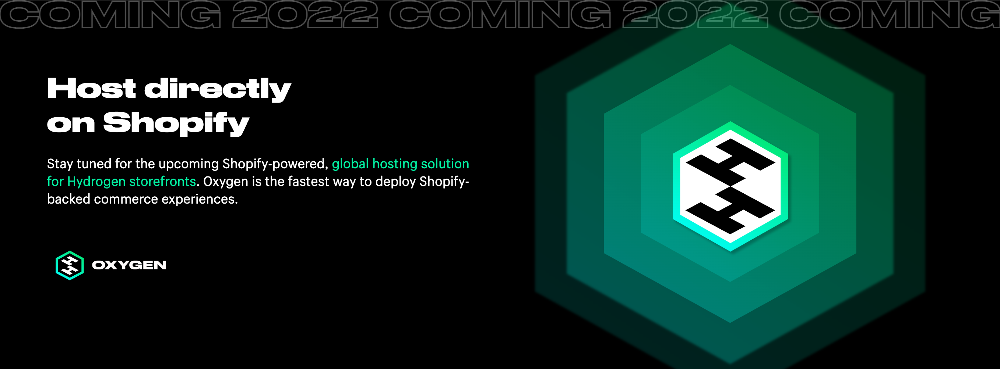

## 背景故事

前天，Shopify 发布了 Hydrogen 的开发者预览版。这项技术第一次亮相是在今年的 Shopify Unite 大会上的最后，Shopify CEO Tobias 亲自上手，坐在电脑前，演示了一段如何使用 React.js 打破现有 Shopify theme 的限制，开发一个高度定制化的店铺界面。在国内，我们称之为「店铺装修」。

](./Untitled.png)

视频链接：[https://www.youtube.com/watch?v=FPNZkPqUFIU](https://www.youtube.com/watch?v=FPNZkPqUFIU)

在演示里，Tobi 使用这个叫 Hydrogen（氢气）的技术框架，实现了一个可以被 360 度拖拽的、多颜色组合 3D 模型的展示功能，效果非常酷炫。

## 「有趣」，有多重要？

在这段演示中，Tobi 不止一次的提到，这个新技术多么有趣（FUN）。

他也提出了一个观点：I think fun is really underrated in business（我认为「乐趣」在商业中被严重低估了）。

接下来他讲的这一段故事，看得我热泪盈眶。

他回顾在 17 年前，他学习了一门很有趣的编程语言 Ruby，并把赌注押在 Ruby on Rails 框架来写 Shopify 的代码，无论是在当年还是现在，Ruby 都是一门非常小众的语言，但是它的特点就是和英语写法很像，自称是程序员最好的朋友，虽然牺牲了运行效率，但是极大的提高了开发效率。

他做这个选择，是因为他从 Ruby 和 Ruby on Rails 那里获得了很多灵感和乐趣，代码写得飞起。也是它们支撑了他走过那些最艰苦难熬的日子，如果没有它们，今天的 Shopify 也不会存在。

他在结尾的时候说，

> I guess what I really learned along the way is that fun is actually good for business, the most creative things in the world are created by talented people, then they are having fun solving problems together.
> 

> 我想我一路走来真正学到的是：乐趣其实对商业是有好处的。世界上最有创意的东西是由有才华的人创造的，然后他们一起享受解决问题的乐趣。

我本人是在 2013 年的时候在大三学习编程，同年也是因为「有趣」而自学的 Ruby 和 Ruby on Rails，后面在法国创业做了个外卖平台，也是用的 Ruby on Rails 搭建的，所以我很能体会 Tobi 对这个技术的热爱。

## 「动态电商」？

回到正题，电商本就应该是「动态」的，不是吗？

Dynamic commerce 这个概念，类似淘系电商的千人千面。可是为什么 Shopify 要强调它呢？

其实 Shopify 面临的问题和国内的电商平台还不太一样。来自世界各地的买家和卖家，用着各式各样的语言、货币、税率和支付方式在进行交易。

而且没有了平台流量的加持，独立站卖家还得每天想着各种办法去引流，把网站做的又好看又快，服务好每一位消费者。

总结成一句话，就是打造差异化（动态）和提供极致的购买体验（快）。

## 「动态」和「快」很难兼得

__快不快，直接影响商家的 GMV。__

当你打开一个网页的时候，

你觉得等了好久还没看到内容，你就关了。

你看到内容了，但是似乎点了按钮没反应，你也关了。

这些都是造成转化率降低的原因。

这里需要介绍两个重要的 Web 指标，LCP 和 FID。

Largest Contentful Paint (LCP) ：最大内容绘制，测量加载性能。为了提供良好的用户体验，LCP 应在页面首次开始加载后的 2.5 秒内发生。

First Input Delay (FID) ：首次输入延迟，测量交互性。为了提供良好的用户体验，页面的 FID 应为 100 毫秒或更短。

简单来说：「等了好久看不到内容」，就是 LCP 太长；「点了按钮或是搜索没反应」，就是 FID 太长。

造成 LCP 太长的原因有很多，除了直接和技术相关的原因，还受到地理位置和网络条件的影响。

Shopify 的服务器和数据库在北美，一个身在亚洲的买家访问了 Shopify 的网站，这个请求需要去到北美的服务器，从数据库取出商品数据渲染，再返回给亚洲的买家展示。如果这个买家用的是 3G 网络，那更是惨不忍睹。

当然实际上的请求链路并不完全像我说的一样。

为了解决地理位置的问题，可以用 CDN 在边缘节点（edge node）缓存渲染好的静态 HTML 页面以及 JS / CSS / 图片等静态资源，这样亚洲的买家下一次访问这个店铺的时候，就会在他就近的服务器，比如香港节点，直接返回页面内容给他。

同时，通过减小 JS 等静态资源的打包体积，来解决用户网络条件差的问题。

静态化可以让加载速度变快，但...

一个店铺里可能就有成百上千个 SKU，卖家每天也需要在后台频繁更改着商品标题、图片、价格。展示给买家的页面总不能一直都是几个小时前缓存的那一份吧？

## 让电商更「动态」也更「快」

Shopify Hydrogen 就是为了解决以上这些问题而生。

首先，什么是 Shopify Hydrogen？Shopify 官方对它的解释原话是：

> It is a front-end web development framework used for building Shopify custom storefronts. It includes the structure, components, and tooling you need to get started so you can spend your time styling and designing features that make your brand unique. 
https://hydrogen.shopify.dev/

粗暴的翻译一下：Hydrogen，用于构建无头电商的 Shopify 绑定框架（只绑定适用于 Shopify）。它是一个用于构建 Shopify 定制店面的前端 Web 开发框架。它包括你需要的项目结构、组件和开发工具，以便你可以把时间花在设计样式和功能上，使你的品牌独一无二。

__本质上，是通过提供更棒的开发者体验，来让开发者搭建速度更快的动态电商。__

Shopify 的店铺界面是由一种基于 Ruby 的模版引擎 Liquid 进行动态渲染的，它是 Shopify CEO Tobi 在 2008 年开源的项目。它让开发者可以编写一些动态逻辑来控制页面上展示的数据，这让很多设计师和开发者可以通过 Shopify theme 来赚钱。

但是开发一个 Shopify theme 的成本却不低，尤其是 React.js 和 Vue.js 这样的现代前端框架流行起来之后，了解并熟悉 Liquid 语法的 UI 开发者越来越少。

同时，Liquid 的性能也一直不是很理想，虽然 Shopify 近几年对 Storefront 渲染引擎做了很多优化，包括把 Storefront 渲染引擎从 Rails 巨石应用里面解耦出来，也用 C 语言写了 Liquid 扩展库。但是由于动态渲染引擎依旧需要在 Shopify 的北美服务器完成，所以依旧有着很大的优化空间。

### Hydrogen 的第一个「快」，是页面加载快

那么就必须先解决渲染引擎的性能问题。

1. 边缘计算 Edge computing：渲染引擎在就近的边缘段节点做计算
2. 流式服务端渲染 Streaming Server-side rendering：无需等待渲染完全完成，就让浏览器尽快接收到页面数据

对于那位在亚洲的 3G 网络手机端买家来说，

他访问页面的请求被就近的香港节点处理到，

取到数据，开始渲染，

不用等待渲染完成，就能流式返回渲染了一部分的页面。

在这样的渲染模式下，在全球任何一个地方的买家，都有可能在一秒内打开任何一个基于 Hydrogen 技术的 Shopify 店铺网站。

这个看上去很完美，但是一直无法实现的能力。通过 React.js 的 Streaming SSR 能力以及类似 Vercel 和 Netlify 这样提供边缘计算能力（edge computing）的平台，将会变成可能。

### Hydrogen 的第二个「快」，是开发效率快

原来，改一行代码，都需要重新打包（bundle），如此反复。

而搭载了 Vite.js 作为打包工具的 Hydrogen，底层是基于 ES Modules 的新一代 bundleless 编译器，只编译不打包，相比 bundle 模式要快 90% 以上。现在一眨眼的功夫，你改的样式就自动更新到浏览器上了，用起来非常之爽。

同时选用了具备 Streaming SSR 能力的 React.js 作为基础库，有着最庞大的前端社区生态，有大把现成的组件，帮开发者轻松实现任何一个酷炫的交互功能。

样式则用了最近非常火的 TailwindCSS，没有先入为主的预定样式，而是提供丰富的 utilities class 来帮你实现独一无二的设计样式，非常适合电商这个场景。

再加上 Hydrogen 集成好的 Shopify API 组件库，让你只需要关注样式和功能，高速迭代。

最重要的是，这一套技术栈在现在的前端人才市场里，基本上每个开发者都会，不存在招人难的问题。

### Hydrogen 的第三个「快」，是全球化部署快

新一代全球边缘计算部署平台 Oxygen（氧气），将在明年年初推出。

当代码推到仓库的那一刻，就开始在全球所有的边缘节点服务器部署新的代码变更，还支持分支预览，开发体验直接拉满！

这次的开发者预览版也放出了一个体验版店铺，https://shopify.supply，来感受一下 Hydrogen 到底有多快吧！

## 写在最后

虽然是一篇介绍技术的文章，但更多也是为了让更多人了解海外电商的趋势。从技术视角去看，以为技术也是为了解决商业难题的。某个技术方向的出现，侧面也反映了行业在面临着怎样的挑战。

最后，希望「Make business more FUN」这颗种子可以在更多人的心里萌芽。Respect！

> 欢迎关注 Shopify Hunt 微信公众号，获得最前沿的跨境电商科技产业资讯！