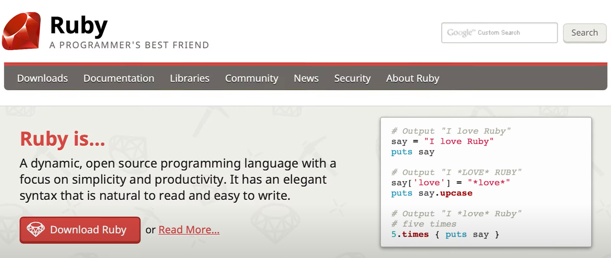
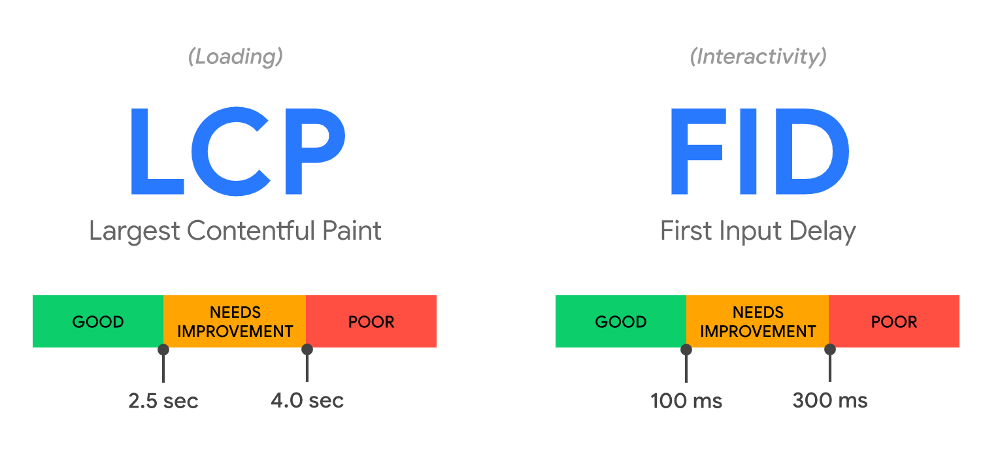

## 背景故事

昨天，Shopify 发布了 Hydrogen 的开发者预览版。这项技术第一次亮相是在今年的 Shopify Unite 大会上的最后，Shopify CEO Tobias 亲自上手，坐在电脑前，演示了一段如何使用 React.js 打破现有 Liquid theme 的限制，开发一个高度定制化的店铺界面。在国内，我们称之为「店铺装修」。

](./Untitled.png)

视频链接：[https://www.youtube.com/watch?v=FPNZkPqUFIU](https://www.youtube.com/watch?v=FPNZkPqUFIU)

在演示里，Tobi 使用这个叫 Hydrogen（氢气）的技术框架，实现了一个可以被 360 度拖拽的、多颜色组合 3D 模型的展示功能，效果非常酷炫。

要实现类似这样的交互效果，需要用上某个第三方 JavaScript 代码库，或者安装某个 Shopify 插件。即使如此，引入过多的第三方 JavaScript 脚本，对于网站的加载速度会有很大的负面影响，对于商家来说，就是更低的转化率。

更重要的是，这一切对于开发者来说显得有些 “别扭“。从开发工具、技术栈，到开发体验（DX），都有些过时，对于开发者来说可能就不那么「有趣」了。

## 「有趣」，有多重要？

在这段演示中，Tobi 不止一次的提到，这个新技术多么有趣（FUN）。

他也提出了一个观点：I think fun is really underrated in business（我认为「乐趣」在商业中被严重低估了）。

接下来他讲的这一段故事，看得我热泪盈眶。

他回顾在 17 年前，他学习了一门很有趣的编程语言 Ruby，并把赌注押在 Ruby on Rails 框架来写 Shopify 的代码，无论是在当年还是现在，Ruby 都是一门非常小众的语言，但是它的特点就是和英语写法很像，自称是程序员最好的朋友。

他做这个选择，是因为他从 Ruby 和 Ruby on Rails 那里获得了很多灵感和乐趣，代码写得飞起。也是它们支撑了他走过那些最艰苦难熬的日子，如果没有它们，今天的 Shopify 也不会存在。

他在结尾的时候说，

> I guess what I really learned along the way is that fun is actually good for business, the most creative things in the world are created by talented people, then they are having fun solving problems together.
> 

> 我想我一路走来真正学到的是：乐趣其实对商业是有好处的。世界上最有创意的东西是由有才华的人创造的，然后他们一起享受解决问题的乐趣。
> 

我本人是在 2013 年的时候开始在大三学习编程，同年也是因为「有趣」，开始接触 Ruby 和 Ruby on Rails，后面用它创业写了一个外卖平台的项目。那段时间是困难并充满激情的，所以我很能体会 Tobi 对这个技术的热爱。

## 痛点与价值

回到正题，Shopify 为什么要推出这么一个技术，它解决了什么问题？以及为什么 Shopify Hydrogen 可以解决这些问题？

「店铺装修带来差异化」、「定制化研发成本可控」、「加载速度快」这几个关键词是在独立站进入 SaaS 时代后，来自商家的新一轮诉求。

**「店铺装修带来差异化」**

在电商世界里，提高 GMV 是永恒不变的追求。Shopify 通过 SaaS 的形式提供一个标准化的技术解决方案来摊薄电商卖家的进入门槛 —— 你不再需要一个技术团队才能做属于你自己的独立站。

但同时 SaaS 只解决了 80% 的通用化需求，无法解决另外的 20% 客制化需求。Shopify 通过「主题 Theme」和「插件 Shopify App」来提供客制化方案，来帮助商家打造差异化，提供给买家特别的购买体验。

**「定制化研发成本可控」**

「主题 Theme」和「插件 Shopify App」构成了 Shopify 的护城河，围绕设计师、开发者、合作伙伴打造了一个强大的生态体系，这都使得卖家可以免费或只用支付一个远远低于自研的成本，就可以拥有一些区别于其他卖家的店铺设计和功能。

**「加载速度快」**

当你打开一个网页的时候，

你觉得等了好久还没看到内容，你就关了。

你看到内容了，但是似乎点了按钮没反应，你也关了。

这些都是造成转化率降低的原因。

这里需要介绍两个重要的 Web 指标，LCP 和 FID。

Largest Contentful Paint (LCP) ：最大内容绘制，测量加载性能。为了提供良好的用户体验，LCP 应在页面首次开始加载后的2.5 秒内发生。

First Input Delay (FID) ：首次输入延迟，测量交互性。为了提供良好的用户体验，页面的 FID 应为100 毫秒或更短。

简单来说：「等了好久看不到内容」，就是 LCP 太长；「点了按钮或是搜索没反应」，就是 FID 太长。

造成 LCP 太长的原因有很多，除了技术相关的原因，还受到地理位置和网络条件的影响。

Shopify 的服务器和数据库在北美，一个身在亚洲的买家访问了 Shopify 的网站，这个请求需要去到北美的服务器，从数据库取出商品数据渲染，再返回给亚洲的买家展示。如果这个买家用的是 2G/3G 网络，那更是惨不忍睹。

当然实际上的请求链路并不完全像我说的一样。

为了解决地理位置的问题，可以用 CDN 在边缘节点（edge node）缓存渲染好的静态页面以及 JS/CSS/图片等静态资源，这样亚洲的买家下一次访问这个店铺的时候，就会在他就近的服务器，比如香港节点，直接返回页面内容给他。

同时，通过减小 JS 等静态资源的打包体积，来解决用户网络条件差的问题。

缓存了静态资源可以解决一部分问题，但是一个店铺里可能就有成百上千个 SKU，卖家每天也需要在后台频繁更改着商品标题、图片、价格，展示给买家的页面总不能一直都是几个小时前缓存的那一份吧？

而 Shopify Hydrogen 就是为了解决以上这些问题而生。

Shopify 过往对于技术的选型和投入都是有着深刻的底层逻辑的，所以理解 Shopify 在技术上的投资，可以看到未来 5 年全球电商行业的大趋势。

首先，什么是 Shopify Hydrogen？Shopify 官方对它的解释原话是：

> Hydrogen: Shopify's opinionated framework for building headless ecommerce. It is a front-end web development framework used for building [Shopify custom storefronts](https://shopify.dev/custom-storefronts/getting-started). It includes the structure, components, and tooling you need to get started so you can spend your time styling and designing features that make your brand unique.
> 

粗暴的翻译一下：Hydrogen，Shopify 用于构建无头电商的绑定框架（只绑定适用于 Shopify）。它是一个用于构建 Shopify 定制店面的前端 Web 开发框架。它包括你需要的架构、UI 组件和工具，以便你可以把时间花在设计样式和功能上，使你的品牌独一无二。

**本质上，是一次「页面渲染模式向提供更好的用户体验」的进步。**

虽然 Shopify 近几年对 Storefront 渲染引擎做了很多优化，包括[把 Storefront 渲染引擎从 Rails 巨石应用里面解耦出来](https://shopify.engineering/how-shopify-reduced-storefront-response-times-rewrite)，也用 [C 语言写了 Liquid 扩展库](https://github.com/Shopify/liquid-c)。但是由于动态渲染引擎依旧需要在 Shopify 的北美服务器完成，所以依旧有着很大的优化空间。

第一个思路，渲染引擎能不能搬到边缘节点去计算（edge computing）？

其次，是否能用流式服务端渲染（Streaming Server-side rendering）让用户尽快接受到页面数据？

对于那位在亚洲的 2G 网络手机端买家来说，

他访问的请求被就近的香港节点处理到，

取到数据，开始渲染，

不用等待渲染完成，就能流式返回渲染了一部分的页面。

在这样的渲染模式下，在全球任何一个地方的买家，都有可能在**一秒内**打开任何一个基于 Hydrogen 技术的 Shopify 店铺网站。

这个看上去很完美，但是一直无法实现的能力，通过 React.js 的 React Server Components 加上 Vercel 和 Netlify 这样的提供边缘计算能力的平台，将会变成可能。

## 写在最后

鉴于这篇文章的读者不一定都是了解这些技术细节的开发者，所以写得比较通俗。目的是为了让更多人了解海外电商的趋势，虽然从技术视角去看，但是技术也是为了解决商业难题的。某个技术方向的出现，侧面也反映了行业在面临着怎样的挑战。

最后，希望「Make business more FUN」这颗种子可以在更多人的心里萌芽。Respect！